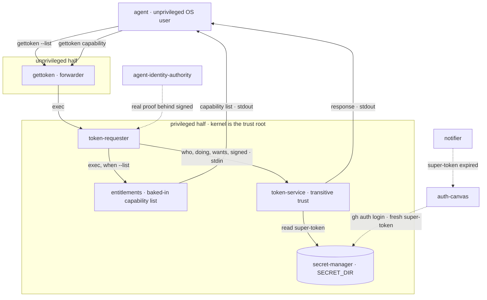
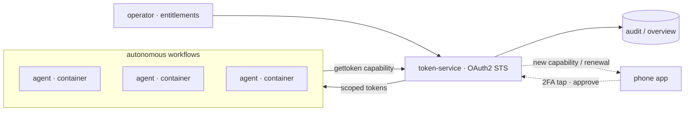

A text-based, POSIX-native token broker for AI agents.

## The problem

Agents need the same tools people use, and those tools ask for a person. A
browser opens, a login is typed, a prompt waits for someone to approve. An agent
cannot answer any of it.

Handing the agent a long-lived credential instead removes that obstacle and
creates a worse one. An agent can be talked into things by whatever it reads, and
it can simply malfunction. Whatever authority it holds is the authority that goes
wrong.

`gettoken` gives an agent a token narrow enough for the job in front of it and
nothing more, drawn from the credentials a human already holds.

## Principles

- **Functional from the start.** Every component exists from the first commit at
  whatever depth it needs, and the chain runs end to end at every commit. There
  is no state in which the system is half-built and waiting to be wired up.
- **Modular, evolvable one piece at a time.** The schemas in `contracts/` are
  fixed; what sits behind them is not. Any component can be replaced or deepened
  without its neighbours noticing.
- **Scalable by adding tools.** A tool is integrated by publishing a package that
  depends on `gettoken`. Nothing central is edited, so the hundredth tool costs
  what the first one did.

## Components

Fixed faces (name + concern). The implementation of each evolves left to right.

| # | Component | Concern | Beginning | Future |
|---|-----------|---------|-----------|--------|
| 1 | `gettoken` | agent's entry point; `--list` and `<capability>` | forwarder | stable |
| 2 | `token-requester` | privileged half; builds the request | local root/dev | gh app signing → orchestrator/container id |
| 3 | `token-service` | authenticate, resolve, exchange | transitive trust, as-is | verify `signed` → off-the-shelf OAuth2 STS |
| 4 | `notifier` | summon a human to renew | beep + shell | 2FA/phone → mostly automated |
| 5 | `auth-canvas` | surface the human acts on | prepped shell (`gh auth login`) | mobile/web |
| 6 | `secret-manager` | holds super-tokens on the privileged side, keyed by (who, doing, wants) | privileged folder | secrets manager |
| 7 | `entitlements` | what an agent may equip | script entry | operator-managed |
| 8 | `agent-identity-authority` | proves who the agent is | local OS user | gh app signed → GCP service principal |

## Architecture

The request path. `gettoken` is the only face the agent sees; everything past
the privilege boundary is the trusted half. The super-token never crosses back —
`token-service` reads it server-side and returns only the exchanged response.



## Contracts

- `contracts/request.schema.json` — the request: `who`, `doing`, `wants`, `signed`.
- `contracts/response.schema.json` — the response: `access_token`, `expires_in`,
  `wants`.
- `contracts/defs.schema.json` — every domain object defined once; the request
  and response only `$ref` these, never inline a constraint.

```json
{
  "who":    "rasmus",
  "doing":  "johans-laptop/review",
  "wants":  "github/thruput-io/gettoken/pr/create",
  "signed": "host-privileged"
}
```

## Run it

```sh
make test
```

The chain runs end to end: a capability is listed, a request is built, a response
comes back, and `gettoken` emits the token and nothing else. This is the
invariant: keep it green.

## Vision

Many agents running autonomous workflows in containers, self-serving scoped
tokens from an OAuth2 STS. The operator sets what each agent may equip;
everything is audited. A human is pulled in only for approvals — a tap on a
phone to renew a super-token or grant a new capability.



## Layout

```
bin/         the executables (gettoken, token-requester, token-service, entitlements)
contracts/   the fixed schemas — the sacred part
test/        the end-to-end walk
```
