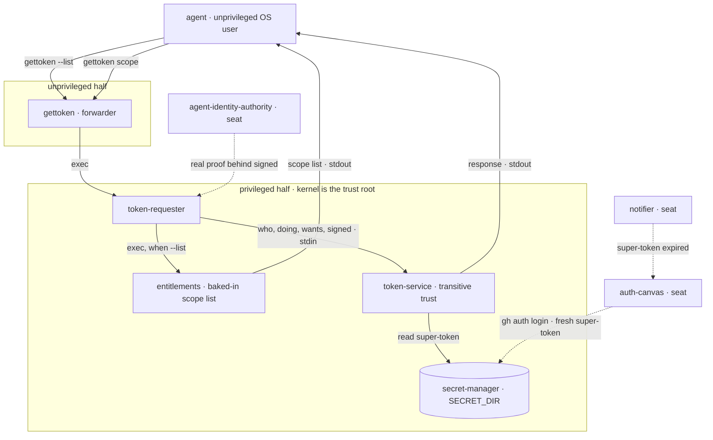
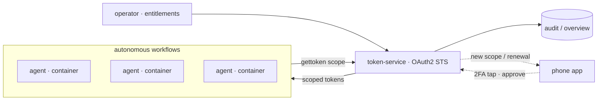

# gettoken

A text-based, POSIX-native token broker for AI agents.

An agent is a user, not a new kind of system. Identity, isolation, and authority
are the OS user model, privilege separation, and a package manager — reused, not
reinvented. The wire is stdin/stdout and exit codes. A request says who is
asking, what they are doing, what they want, and what vouched for them — four
readable fields, so anything on the wire can be read without decoding it.

## Principles

- **Working end-to-end is an invariant, not a goal.** Every commit keeps the
  chain running (`test/walk.sh` stays green).
- **Completeness and depth are independent.** Every component exists as a stub
  that honors its contract; the system is always complete, and depth is added to
  one component at a time, on demand.
- **Contracts are fixed; implementations are disposable.** The schemas in
  `contracts/` are the sacred part. A stub behind a stable contract can be
  replaced with the real thing invisibly to its neighbours.
- **Reuse human-refined technology.** POSIX, apt, `gh`, an OAuth2 STS. Adopt the
  vocabulary and semantics, never the transport you would not use yourself.

## Components

Fixed faces (name + concern). The implementation of each evolves top-to-bottom;
the first incarnation is what ships in this repo.

| # | Component | Concern | First incarnation → future |
|---|-----------|---------|----------------------------|
| 1 | `gettoken` | agent's entry point; `--list` and `<scope>` | forwarder (stable) |
| 2 | `token-requester` | privileged half; builds the request | local root/dev → gh app signing → orchestrator/container id |
| 3 | `token-service` | authenticate, resolve, exchange | transitive trust, as-is → verify `signed` → off-the-shelf OAuth2 STS |
| 4 | `notifier` | summon a human to renew | beep + shell → 2FA/phone → mostly automated |
| 5 | `auth-canvas` | surface the human acts on | prepped shell (`gh auth login`) → mobile/web |
| 6 | `secret-manager` | holds super-tokens on the privileged side, keyed by (agent, location, scope) | privileged folder → secrets manager |
| 7 | `entitlements` | what an agent may equip | script entry → operator-managed |
| 8 | `agent-identity-authority` | proves who the agent is | local OS user → gh app signed → GCP service principal |

Components 4–8 are named seats. This walking skeleton implements the request
path (1 → 2 → 3, with 6 and 7 as stubs). The notifier, auth-canvas, and
identity authority are the next seats to fill, on demand.

## Architecture

The request path as it runs today. `gettoken` is the only face the agent sees;
everything past the privilege boundary is the trusted half. The super-token
never crosses back — `token-service` reads it server-side and returns only the
exchanged response. Nodes marked *seat* are named but not yet implemented.



## Contracts

- `contracts/request.schema.json` — the request: `who`, `doing`, `wants`, `signed`.
- `contracts/response.schema.json` — the response: `access_token`, `expires_in`,
  `scope`.
- `contracts/defs.schema.json` — every domain object defined once; the request
  and response only `$ref` these, never inline a constraint.

```json
{
  "who":    "rasmus",
  "doing":  "johans-laptop/review",
  "wants":  "github/thruput-io/gettoken/pr/create",
  "signed": "host-privileged"
}
```

The agent must never hold the super-token, so no subject token appears in the
request. `who` and `doing` are top-level, so the caller's identity and context
are readable without decoding anything. `signed` names what vouched for the
request: `host-privileged` means it was produced on the privileged side of this
host, and token-service does not verify it yet. token-service fetches the
super-token server-side from the secret-manager.

## Run the walking skeleton

```sh
sh test/walk.sh
```

It lists the one known scope, checks the request `token-requester` builds, then
requests the scope end to end and checks the exact response body. This is the
invariant: keep it green.

## Vision

Many agents running autonomous workflows in containers, self-serving scoped
tokens from an OAuth2 STS. The operator sets what each agent may equip;
everything is audited. A human is pulled in only for approvals — a tap on a
phone to renew a super-token or grant a new scope.



## Layout

```
bin/         the executables (gettoken, token-requester, token-service, entitlements)
contracts/   the fixed schemas — the sacred part
test/        the end-to-end walk
```
