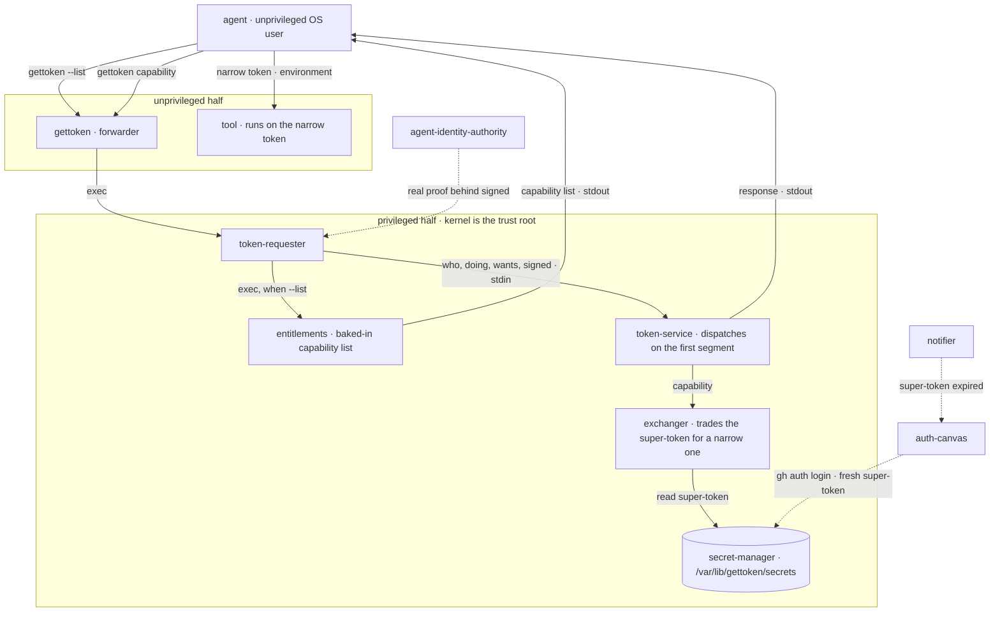
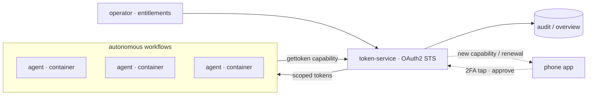

A text-based, shell-native token broker for AI agents.

## The problem

Agents need the same tools people use, and those tools ask for a person. A
browser opens, a login is typed, a prompt waits for someone to approve. An agent
cannot answer any of it.

Handing the agent a long-lived credential instead removes that obstacle and
creates a worse one. An agent can be talked into things by whatever it reads, and
it can simply malfunction. Whatever authority it holds is the authority that goes
wrong.

`gettoken` gives an agent a token narrow enough for the job in front of it and
nothing more, drawn from the credentials a human already holds. The agent never
holds the super-token: it says what it wants, and gets back a token for that job
and nothing else.

Accountability stays with the human. The human holds the super-token and grants
pieces of it. This repository is retired when reasoning alone makes an agent
trustworthy enough that nobody needs to hold a super-token and hand out pieces of
it.

## Principles

1. **Package the tools humans already built.** We write no new tooling. The test
   for anything added: does it replace the tool, or supply what the tool needs?
   Replacing is a parallel path; supplying is packaging.
2. **Non-intrusive.** A tool package does not change the tool. Nothing is
   rewritten, no credential is left behind, and removing the package leaves
   nothing behind either.
3. **Functional from the start.** Every component exists from the first commit at
   whatever depth it needs, and the chain runs end to end at every commit. There
   is no state in which the system is half-built and waiting to be wired up.
4. **Modular, evolvable one piece at a time.** The schemas in `contracts/` are
   fixed; what sits behind them is not. Any component can be replaced or deepened
   without its neighbours noticing.
5. **Scalable by adding tools.** A tool is integrated by publishing a package that
   depends on `gettoken`. Nothing central is edited, so the hundredth tool costs
   what the first one did.

## Components

Fixed faces (name + concern). The implementation of each evolves left to right.

| # | Component | Concern | Beginning | Future |
|---|-----------|---------|-----------|--------|
| 1 | `gettoken` | agent's entry point; `--list` and `<capability>` | forwarder | stable |
| 2 | `token-requester` | privileged half; builds the request | local root/dev | gh app signing → orchestrator/container id |
| 3 | `token-service` | authenticate, resolve, hand the capability to an exchanger | transitive trust, as-is | verify `signed` → off-the-shelf OAuth2 STS |
| 4 | `notifier` | summon a human to renew | beep + shell | 2FA/phone → mostly automated |
| 5 | `auth-canvas` | surface the human acts on | prepped shell (`gh auth login`) | mobile/web |
| 6 | `secret-manager` | holds super-tokens on the privileged side, keyed by who holds them and which service they are for | privileged folder | secrets manager |
| 7 | `entitlements` | what an agent may equip | script entry | operator-managed |
| 8 | `agent-identity-authority` | proves who the agent is | local OS user | gh app signed → GCP service principal |
| 9 | `exchanger` | turns a super-token into a narrow one for one service | one per capability segment, found in `/usr/lib/gettoken/exchangers` | its own package, beside the tool it integrates |
| 10 | `renewer` | obtains a fresh super-token for one service, with a human present | runs the tool's own login | device flow → phone approval |

Components 1–8 are shared. 9 and 10 are shipped once per integrated tool: each
knows one service, and neither knows anything about the others.

`gettoken` writes the token and nothing else. The response document stays between
`token-service` and `token-requester`; none of it reaches the agent. A failure
writes to stderr and leaves stdout empty, so a caller cannot assign an error
message to a credential. The agent asks again every time it needs a token — it is
not told when one expires and does not track one. Caching belongs to the
privileged half.

`token-service` dispatches on the first segment of the capability, and the
exchanger registered for that segment performs the exchange. An exchanger
translates the capability into whatever that service actually wants — for GitHub a
set of permissions on the repository named in the capability, not GitHub's own
coarse scopes. It issues a token that lives as short a time as possible, ideally
two minutes.

## Architecture

The request path. `gettoken` is the only face the agent sees; everything past
the privilege boundary is the trusted half. The super-token never crosses back —
the exchanger is the only thing that touches it, and what comes back is the
narrow token it issued.



## Vocabulary

A **capability** is a name, and it is not a secret:

```
github/thruput-io/gettoken/pr/create
```

**`entitlements`** is a file named for the agent, listing the capabilities that
agent has. It is the inventory — it answers "what do I have to work with", and it
is what `gettoken --list` shows. It is also the control: a request for a
capability that is not in the file is refused.

**`signed`** names what vouched for the request. `host-privileged` means the
request was produced on the privileged side of this host. That is accepted here,
because it is true here; nothing off this host accepts it, because nothing off
this host can know it. The key that signs a request is one-to-one with the first
segment of **`doing`**, and the deployment is where that key is put.

## Contracts

- `contracts/token-request.schema.json` — the request: `who`, `doing`, `wants`, `signed`.
- `contracts/token-response.schema.json` — the response: `access_token`, `expires_in`.
- `contracts/defs.schema.json` — every domain object defined once; the request
  and response only `$ref` these, never inline a constraint.

```json
{
  "who":    "rasmus",
  "doing":  "johans-laptop/review",
  "wants":  "github/thruput-io/gettoken/pr/create",
  "signed": "host-privileged"
}
```

An exchanger is a component like any other, so contracts govern both ends of it.
`token-service` finds it in `/usr/lib/gettoken/exchangers`, named for the first
segment of the capability, hands it an `exchange-request` on standard input and
reads a `token-response` back. It is told who is asking and what for, and neither
the signature the request was signed with nor what the agent was doing, because
those are not an exchanger's to see. It is looked up in that one directory rather
than on `PATH`, because it is run with the super-token in reach.

## Install it

Distribution is `apt`, and the packages are built from this tree rather than kept
in it. Building them leaves an apt repository behind, so installing is what it
would be from any other archive:

```sh
make packages
```

That writes `build/packages/deb-stable/` and `build/packages/deb-testing/`, each
holding every `.deb` for that release and a `Packages` index. Point apt at the one
for the release you are on and ask for the one tool:

```sh
echo "deb [trusted=yes] file:/path/to/build/packages/deb-stable ./" | sudo tee /etc/apt/sources.list.d/gettoken.list
sudo apt-get update
sudo apt-get install integration-test-tool
```

Asking for that one package installs twenty-two: the tool, `gettoken`, the
privileged half behind it, the store, the dispatcher, the two programs that carry
a document through a contract, and one package per contract. Nothing else is
named, and nothing else arrives. Purging it takes them all with it, and the store
with them.

`make packages` builds for both Debian stable and Debian testing, leaving each
in its own directory under `build/packages/`. The two say different things about
themselves because the releases carry different debhelper, lintian and Go, and
what each target is is written in `scripts/targets/`: what that release's archive
carries and what its Policy wants said, stated rather than sniffed, so a build
that finds something different says so. `lintian` at pedantic is what proves the
statement, on the source and on every package.

Nothing under `debian/` that can be derived is kept. `debian/control` and one
`.install` per contract are written by `scripts/packaging.sh` from the contracts,
the components and the target, before `dpkg` reads anything, because `dpkg`
resolves build dependencies out of `debian/control` before any rule could act.
`debian/control.in` carries only what none of those know, which is prose about
the components themselves.

To install onto a machine that is not the one that built them, copy that
release's directory across and point apt at it there. It is a plain apt repository:
nothing in it depends on having been built locally.

### What arrives, and why that is the interesting part

A contract is an interface, so it is a package, and a component depends on the
contracts it speaks. That dependency is the statement of what may reach what, and
`apt` answers it:

```sh
apt-cache depends gettoken-secret-manager | grep contract
```

The store depends on the five documents it reads and writes and on nothing else.
`gettoken`, which is what an agent invokes, depends on the two asks it builds and
on neither the token nor the entitlements contracts, because those belong to the
privileged half it hands the ask to. An exchanger that has no business seeing a
signature does not depend on the contract carrying one.

`parse` and `format` are separate packages carrying no contract of their own, so a
component that only ever reads a document does not install the program that writes
one — `gettoken` depends on `gettoken-format` alone.

`/usr/bin` carries the agent's entry point and nothing else. Everything on the
privileged side lives in `/usr/lib/gettoken`, which `gettoken` puts on `PATH`
before it crosses over; a human working on that side puts it on their own.

Integrating a tool means publishing a package that depends on `gettoken` and
installs one exchanger into `/usr/lib/gettoken/exchangers`. Where the tool is one
someone else already packages, that is a second package alongside theirs, because
theirs is not ours to change — `gh-gettoken` next to `gh`. `integration-test-tool`
stands in for that: the tool and the exchanger beside it are two packages, because
the tool is not ours to speak for and the exchanger is.

## Vision

Many agents running autonomous workflows in containers, self-serving scoped
tokens from an OAuth2 STS. The operator sets what each agent may equip;
everything is audited. A human is pulled in only for approvals — a tap on a
phone to renew a super-token or grant a new capability.



## Layout

`contracts/` is the wire between the two sides and belongs to neither.
`components/` holds machinery more than one tool shares; a component nothing
implements yet carries a `SEAT.md` saying what it is for, so the list stays whole.
A tool lives under `tools/` and owns its own privileged half, so the boundary sits
inside the tool rather than across the top of the tree. Man pages live with what
they document. `exploratory/` answers a question rather than guarding the
product. `debian/` says which of these goes into which
package, and it is one directory because Debian builds many packages from one
source tree.

<!-- layout -->
```
contracts/
  agent-capability-request.schema.json
  agent-list-request.schema.json
  defs.schema.json
  entitlements-request.schema.json
  entitlements-response.schema.json
  exchange-request.schema.json
  secret-get-request-version.schema.json
  secret-get-request.schema.json
  secret-get-response.schema.json
  secret-put-request.schema.json
  secret-put-response.schema.json
  token-request.schema.json
  token-response.schema.json

components/
  agent-identity-authority/   SEAT.md
  auth-canvas/                SEAT.md
  contract/                   parse and format, in Go
  entitlements/
  notifier/                   SEAT.md
  secret-manager/
  token-service/

tools/
  gettoken/
    bin/
    man/
    privileged/
    test/
  integration-test-tool/
    bin/
    man/
    privileged/
    test/

debian/
  changelog
  control.in
  copyright
  gettoken-entitlements.install
  gettoken-format.install
  gettoken-parse.install
  gettoken-secret-manager.install
  gettoken-secret-manager.postrm
  gettoken-token-requester.install
  gettoken-token-service.install
  gettoken.docs
  gettoken.install
  gettoken.manpages
  integration-test-tool-exchanger.install
  integration-test-tool.install
  integration-test-tool.manpages
  rules
  source/format
  source/lintian-overrides

scripts/
  deliver.sh
  docker/
  fixtures/
  lint.sh
  mermaid.sh
  packaging-check.sh
  packaging.sh
  readme.sh
  targets/
  test/

integration-test/
  test.sh

exploratory/
```
<!-- end layout -->
